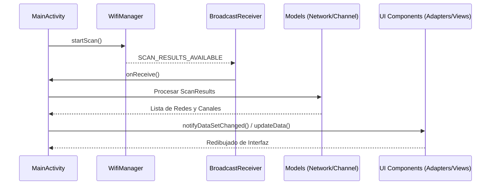

# Arquitectura de Spectrum24GHz

## Descripción
Aplicación para análisis de espectro WiFi en la banda de 2.4 GHz. Permite escanear redes en tiempo real, analizar saturación de canales y visualizar estabilidad de señal.

Sigue un patrón **MVC** simplificado donde `MainActivity` coordina la adquisición de datos via `WifiManager` y actualiza la interfaz.

## Punto de Entrada
Punto de entrada: **`MainActivity.java`**. Configurada en `AndroidManifest.xml` como la actividad principal (`MAIN` y `LAUNCHER`).

Función de inicio: **`onCreate(Bundle savedInstanceState)`**.
- Configura View Binding.
- Instancia `WifiManager`.
- Inicializa adaptadores y vistas.
- Gestiona Handlers de escaneo y permisos de WiFi.

## Componentes

### Controlador
- **`MainActivity.java`**: Gestiona permisos, ejecuta escaneos, mantiene el historial y coordina la navegación entre pestañas.

### Adaptadores (UI)
- **`NetworkAdapter.java`**: Lista de redes detectadas con indicadores de señal.
- **`ChannelListAdapter.java`**: Vista de canales (1-14) con cálculo de saturación.

### Vistas Personalizadas
- **`StatisticsGraphView.java`**: Gráficas de calidad de señal, uso de canales y seguridad.
- **`TimeGraphView.java`**: Gráfica de potencia de señal (dBm) sobre ventana de tiempo.

## Modelos de Datos (`com.spectrum24ghz.models`)
- **`ScannedNetwork.java`**: Datos del punto de acceso (SSID, BSSID, RSSI, frecuencia, seguridad).
- **`WifiChannel.java`**: Datos del canal (frecuencia y lista de redes asociadas).

## Flujo de Datos

1. **Activación**: `MainActivity` dispara escaneo en `WifiManager`.
2. **Recepción**: `BroadcastReceiver` detecta resultados.
3. **Procesamiento**: `ScanResult` → `ScannedNetwork` → `WifiChannel`.
4. **Visualización**: Actualización de adaptadores y vistas gráficas.

## Glosario
- **[MVC](https://developer.android.com/topic/architecture)**: Separación de Modelo, Vista y Controlador.
- **[Views](https://developer.android.com/reference/android/view/View)**: Elementos básicos de UI en Android.
- **[RecyclerView](https://developer.android.com/develop/ui/views/layout/recyclerview)**: Lista eficiente mediante reciclaje de vistas.
- **[BroadcastReceiver](https://developer.android.com/reference/android/content/BroadcastReceiver)**: Receptor de eventos del sistema.
- **[WifiManager](https://developer.android.com/reference/android/net/wifi/WifiManager)**: API para control y escaneo de Wi-Fi.

## Construcción y Desarrollo
Instrucciones detalladas en **[CONTRIBUTING.md](./CONTRIBUTING.md)**.
